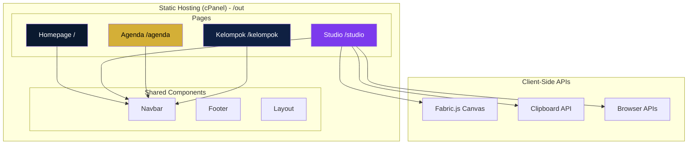
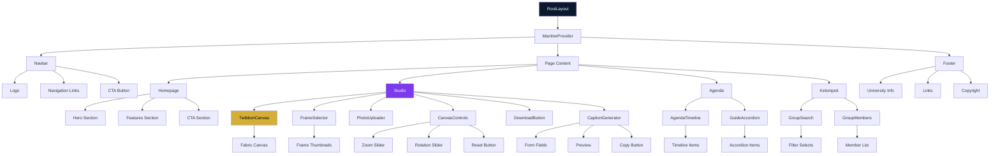
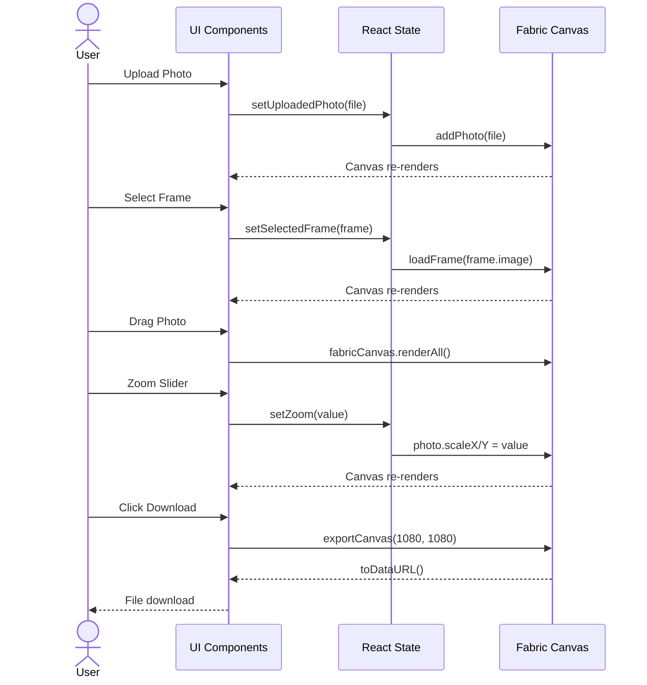
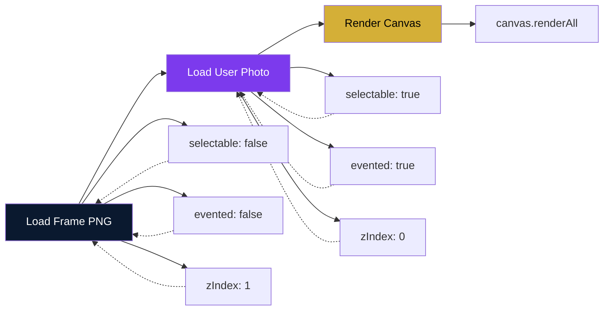
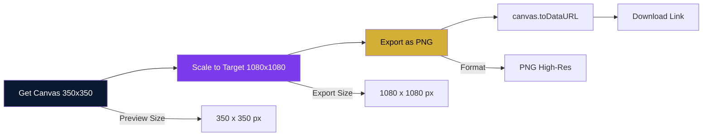
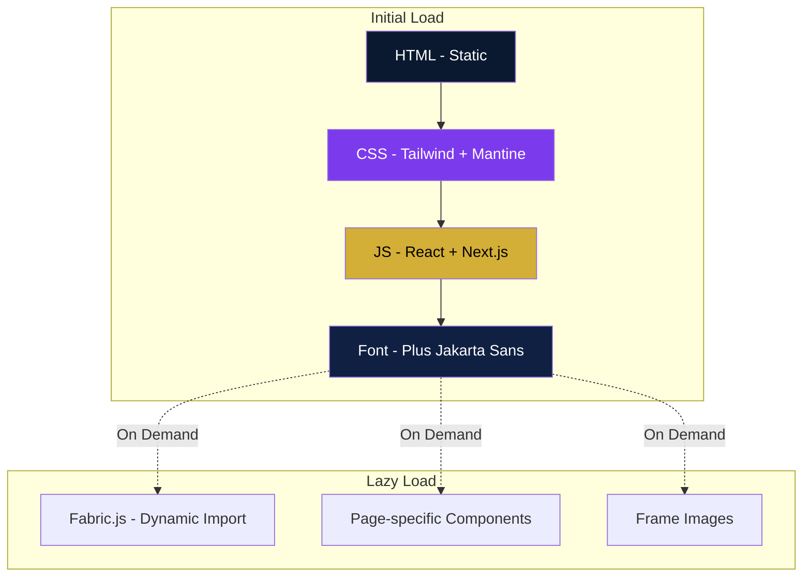
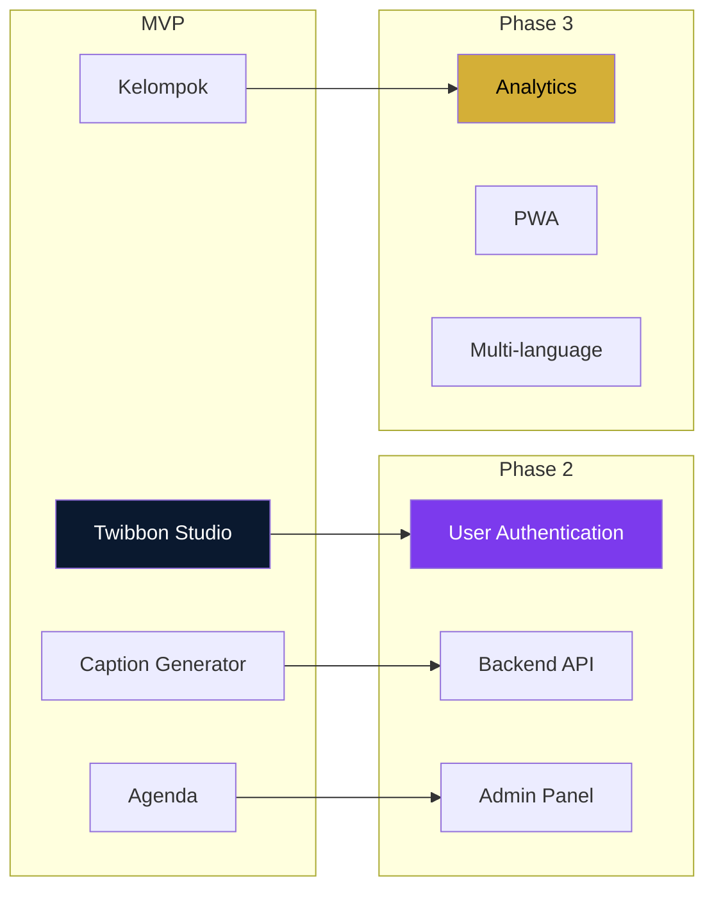
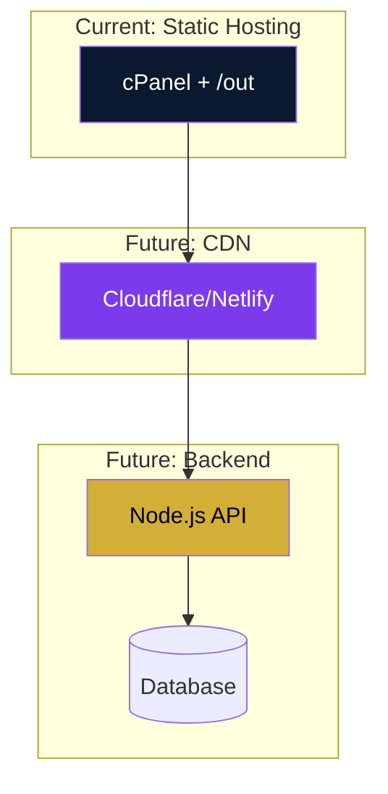

# Architecture Document

## PKKMB IWU — Technical Architecture

**Version:** 1.0  
**Date:** September 2026

---

## 1. System Overview



---

## 2. Directory Structure

```
pkkmb-iwu/
├── public/
│   ├── frames/              # Frame PNG assets
│   │   ├── pkkmb-2026.png
│   │   ├── fst.png
│   │   ├── fisbis.png
│   │   └── pasca.png
│   ├── images/              # Static images
│   │   └── og-image.png
│   └── icons/               # Favicons, icons
│
├── src/
│   ├── app/                 # Next.js App Router
│   │   ├── page.tsx         # Homepage
│   │   ├── layout.tsx       # Root layout
│   │   ├── globals.css      # Global styles
│   │   ├── studio/
│   │   │   └── page.tsx     # Twibbon Studio
│   │   ├── agenda/
│   │   │   └── page.tsx     # Agenda + Panduan
│   │   └── kelompok/
│   │       └── page.tsx     # Kelompok lookup
│   │
│   ├── components/
│   │   ├── layout/
│   │   │   ├── Navbar.tsx
│   │   │   └── Footer.tsx
│   │   │
│   │   ├── studio/
│   │   │   ├── TwibbonCanvas.tsx
│   │   │   ├── FrameSelector.tsx
│   │   │   ├── PhotoUploader.tsx
│   │   │   ├── CanvasControls.tsx
│   │   │   ├── CaptionGenerator.tsx
│   │   │   └── DownloadButton.tsx
│   │   │
│   │   ├── agenda/
│   │   │   ├── AgendaTimeline.tsx
│   │   │   └── GuideAccordion.tsx
│   │   │
│   │   └── kelompok/
│   │       ├── GroupSearch.tsx
│   │       └── GroupMembers.tsx
│   │
│   ├── data/
│   │   ├── frames.ts
│   │   ├── agenda.ts
│   │   └── groups.ts
│   │
│   ├── lib/
│   │   ├── fabric.ts
│   │   ├── image-export.ts
│   │   └── caption-generator.ts
│   │
│   └── types/
│       └── index.ts
│
├── docs/                    # Documentation
│   ├── PRD.md
│   ├── ARCHITECTURE.md
│   ├── COMPONENTS.md
│   ├── DATA.md
│   └── DEPLOYMENT.md
│
├── next.config.ts
├── tailwind.config.ts
├── tsconfig.json
├── package.json
└── postcss.config.js
```

---

## 3. Technology Stack

### 3.1 Core

| Technology | Version | Purpose |
|-----------|---------|---------|
| Next.js | 14+ | Framework, routing, static export |
| TypeScript | 5+ | Type safety |
| React | 18+ | UI library |
| Node.js | 18+ | Build time only |

### 3.2 Styling

| Technology | Purpose |
|-----------|---------|
| Tailwind CSS | Layout, responsive, custom styling |
| Mantine UI | Component library (Button, Modal, etc.) |
| CSS Modules | Component-scoped styles (if needed) |

### 3.3 Canvas

| Technology | Purpose |
|-----------|---------|
| Fabric.js | Canvas manipulation, image processing |

### 3.4 Fonts

| Font | Source |
|------|--------|
| Plus Jakarta Sans | next/font/google |

### 3.5 Icons

| Library | Usage |
|---------|-------|
| Lucide React | General icons |
| Tabler Icons | Alternative icons |

---

## 4. Component Architecture

### 4.1 Component Hierarchy



### 4.2 State Management

**Approach:** Local state + React Context (minimal)

```
Global State (Context):
└── MantineProvider (theme, notifications)

Local State (Component):
└── Studio Page
    ├── fabricInstance (ref)
    ├── selectedFrame (state)
    ├── uploadedPhoto (state)
    ├── zoomLevel (state)
    ├── rotationAngle (state)
    └── captionData (state)
```

**Fabric.js State:**
- Instance stored in `useRef`
- Not shared globally
- Initialized client-side only
- Cleaned up on unmount

---

## 5. Data Flow

### 5.1 Twibbon Studio Data Flow



### 5.2 Canvas Rendering Pipeline



### 5.3 Export Pipeline



---

## 6. Routing

### 6.1 Route Configuration

| Route | Page | Description |
|-------|------|-------------|
| `/` | page.tsx | Homepage |
| `/studio` | studio/page.tsx | Twibbon Studio |
| `/agenda` | agenda/page.tsx | Agenda + Panduan |
| `/kelompok` | kelompok/page.tsx | Kelompok Lookup |

### 6.2 Navigation

**Desktop:**
```
Home | Studio | Agenda | Kelompok | [Buat Twibbon]
```

**Mobile:**
```
Logo | Burger Menu (Drawer)
```

---

## 7. Build & Deployment

### 7.1 Build Process

```bash
# Development
npm run dev

# Production build
npm run build

# Output directory
/out/
```

### 7.2 Static Export Configuration

```typescript
// next.config.ts
const nextConfig = {
  output: 'export',
  images: {
    unoptimized: true,
  },
}
```

### 7.3 Deployment Steps

1. Run `npm run build`
2. Verify `/out` directory generated
3. Upload `/out` contents to cPanel `public_html`
4. Configure `.htaccess` for SPA routing (if needed)

### 7.4 .htaccess Configuration

```apache
RewriteEngine On
RewriteBase /

# Handle client-side routing
RewriteRule ^index\.html$ - [L]
RewriteCond %{REQUEST_FILENAME} !-f
RewriteCond %{REQUEST_FILENAME} !-d
RewriteRule . /index.html [L]
```

---

## 8. Performance Strategy

### 8.1 Loading Strategy



### 8.2 Code Splitting

```typescript
// Dynamic import for Fabric.js
const FabricCanvas = dynamic(
  () => import('@/components/studio/TwibbonCanvas'),
  { ssr: false }
)
```

### 8.3 Image Optimization

- Frame assets: Pre-optimized PNG/WebP
- User photos: Client-side processing only
- No server-side image processing

---

## 9. Security Considerations

### 9.1 Client-Side Only

- No server upload of user photos
- No API endpoints
- No database connections
- No authentication required

### 9.2 Data Privacy

- All processing in browser
- No data sent to external services
- Clipboard API only for copy functionality

### 9.3 Content Security

- Static assets only
- No external scripts (except fonts)
- No third-party analytics (MVP)

---

## 10. Error Handling

### 10.1 Error Types

| Type | Handling |
|------|----------|
| File format error | Mantine Notification |
| File too large | Mantine Notification |
| Canvas init error | Fallback UI |
| Export error | Retry button |
| Clipboard error | Fallback copy method |

### 10.2 Error Boundaries

```typescript
// Global error boundary
app/error.tsx

// Studio-specific errors
studio/page.tsx → try/catch for Fabric.js init
```

---

## 11. Testing Strategy

### 11.1 Test Types (Future)

| Type | Tool | Coverage |
|------|------|----------|
| Unit | Jest | Utilities, helpers |
| Integration | React Testing Library | Components |
| E2E | Playwright | Critical flows |
| Visual | Chromatic | UI regression |

### 11.2 Manual Testing Checklist

- [ ] Mobile responsive (360px-430px)
- [ ] Touch interactions work
- [ ] Canvas renders correctly
- [ ] Export produces high-res image
- [ ] All buttons functional
- [ ] No console errors
- [ ] Static export successful

---

## 12. Future Considerations

### 12.1 Potential Enhancements



### 12.2 Scalability


