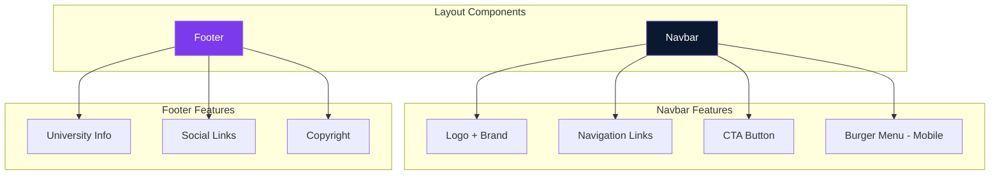
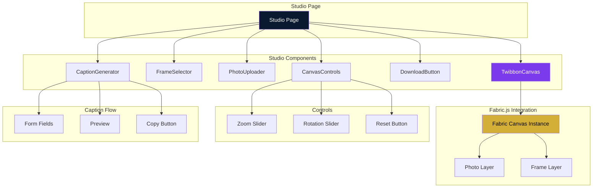
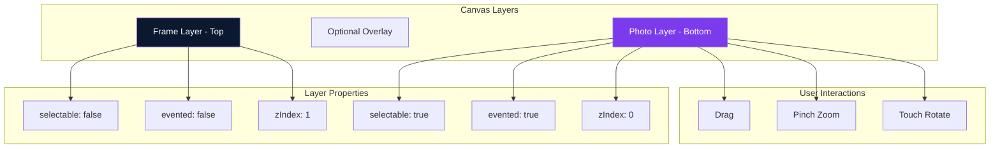
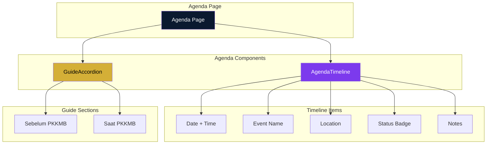
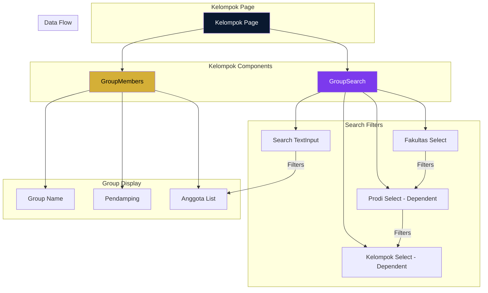
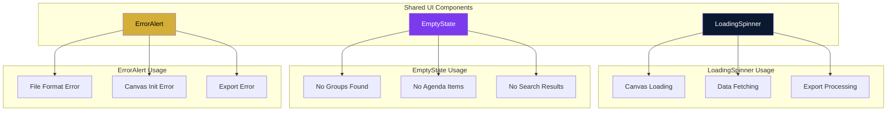
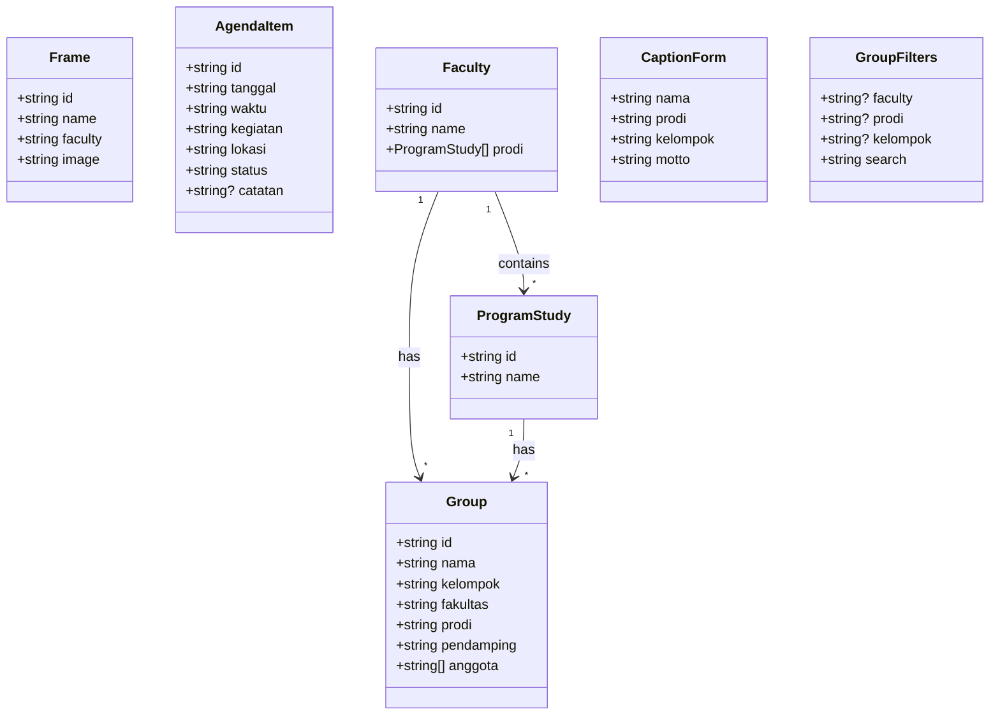

# Component API Documentation

## PKKMB IWU — Component Reference

**Version:** 1.0  
**Date:** September 2026

---

## 1. Layout Components

### 1.1 Component Relationships



### 1.2 Navbar

**File:** `src/components/layout/Navbar.tsx`

**Props:** None

**Features:**
- Sticky navigation
- Logo + brand name
- Navigation links (Desktop)
- Burger menu + Drawer (Mobile)
- CTA button "Buat Twibbon"

**States:**
- Default
- Scrolled (shadow/border added)
- Mobile menu open

**Responsive:**
- Desktop: Horizontal links
- Mobile: Burger → Drawer

---

### 1.2 Footer

**File:** `src/components/layout/Footer.tsx`

**Props:** None

**Content:**
- University name
- PKKMB year
- Location
- Copyright
- Social links (Website, Instagram, Contact)

**Style:** Minimal, single column

---

## 2. Studio Components

### 2.0 Studio Component Architecture



### 2.1 TwibbonCanvas

**File:** `src/components/studio/TwibbonCanvas.tsx`

**Props:**
```typescript
interface TwibbonCanvasProps {
  selectedFrame: Frame | null;
  onCanvasReady?: (canvas: fabric.Canvas) => void;
}
```

**State:**
```typescript
const [canvas, setCanvas] = useState<fabric.Canvas | null>(null);
const [photo, setPhoto] = useState<fabric.Image | null>(null);
const [frameImage, setFrameImage] = useState<fabric.Image | null>(null);
```

**Methods:**
```typescript
// Add photo to canvas
const addPhoto = (file: File) => Promise<void>;

// Set zoom level
const setZoom = (zoom: number) => void;

// Set rotation angle
const setRotation = (angle: number) => void;

// Reset photo position
const resetPosition = () => void;

// Export canvas as PNG
const exportCanvas = (width: number, height: number) => string;
```

**Canvas Configuration:**
```typescript
new fabric.Canvas('twibbon-canvas', {
  width: 350,
  height: 350,
  selection: false,
  preserveObjectStacking: true,
});
```

**Usage:**
```tsx
<TwibbonCanvas
  selectedFrame={selectedFrame}
  onCanvasReady={(canvas) => setCanvas(canvas)}
/>
```

---

### 2.2 FrameSelector

**File:** `src/components/studio/FrameSelector.tsx`

**Props:**
```typescript
interface FrameSelectorProps {
  frames: Frame[];
  selectedFrame: Frame | null;
  onSelect: (frame: Frame) => void;
}
```

**Display:**
- Horizontal scrollable list (mobile)
- Grid layout (desktop)
- Thumbnail preview (80×80)
- Frame name below thumbnail
- Selected state: border + checkmark

**States:**
- Default (no selection)
- Selected (highlighted)

**Usage:**
```tsx
<FrameSelector
  frames={frames}
  selectedFrame={selectedFrame}
  onSelect={setSelectedFrame}
/>
```

---

### 2.3 PhotoUploader

**File:** `src/components/studio/PhotoUploader.tsx`

**Props:**
```typescript
interface PhotoUploaderProps {
  onUpload: (file: File) => void;
  disabled?: boolean;
}
```

**Accepted Formats:**
- image/jpeg
- image/jpg
- image/png
- image/webp

**Max Size:** 10MB (recommended)

**UI:**
- Mantine FileInput
- Drag & drop area (optional)
- Upload icon + text
- Loading state while processing

**Validation:**
- File type check
- File size check
- Error notifications via Mantine

**Usage:**
```tsx
<PhotoUploader onUpload={handleUpload} disabled={!selectedFrame} />
```

---

### 2.4 CanvasControls

**File:** `src/components/studio/CanvasControls.tsx`

**Props:**
```typescript
interface CanvasControlsProps {
  zoom: number;
  rotation: number;
  onZoomChange: (zoom: number) => void;
  onRotationChange: (rotation: number) => void;
  onReset: () => void;
  disabled?: boolean;
}
```

**Controls:**
1. **Zoom Slider**
   - Type: Mantine Slider
   - Min: 0.5
   - Max: 3
   - Step: 0.1
   - Default: 1

2. **Rotation Slider**
   - Type: Mantine Slider
   - Min: -45
   - Max: 45
   - Step: 5
   - Default: 0

3. **Rotation Presets**
   - Buttons: -15°, 0°, 15°
   - Quick selection

4. **Reset Button**
   - Resets zoom to 1
   - Resets rotation to 0
   - Resets photo position

**Usage:**
```tsx
<CanvasControls
  zoom={zoom}
  rotation={rotation}
  onZoomChange={setZoom}
  onRotationChange={setRotation}
  onReset={resetPosition}
  disabled={!photo}
/>
```

---

### 2.5 DownloadButton

**File:** `src/components/studio/DownloadButton.tsx`

**Props:**
```typescript
interface DownloadButtonProps {
  onDownload: () => void;
  disabled?: boolean;
  loading?: boolean;
  fileName?: string;
}
```

**Export Options:**
- Resolution: 1080×1080 (default)
- Format: PNG
- Filename: Custom or default

**UI:**
- Mantine Button
- Download icon
- Loading spinner during export
- Success state after download

**Usage:**
```tsx
<DownloadButton
  onDownload={handleDownload}
  disabled={!photo}
  loading={exporting}
  fileName={`PKKMB-IWU-2026-${name}.png`}
/>
```

---

### 2.6 CaptionGenerator

**File:** `src/components/studio/CaptionGenerator.tsx`

**Props:**
```typescript
interface CaptionGeneratorProps {
  onCopy?: (caption: string) => void;
}
```

**Form Fields:**
```typescript
interface CaptionForm {
  nama: string;
  prodi: string;
  kelompok: string;
  motto: string;
}
```

**Template:**
```typescript
const generateCaption = (data: CaptionForm): string => {
  return `Halo, saya ${data.nama}, mahasiswa baru Program Studi ${data.prodi} International Women University.

Saya siap menjadi bagian dari perjalanan PKKMB IWU 2026 bersama Kelompok ${data.kelompok}.

"${data.motto}"

Let's grow, learn, and lead together.

#PKKMBIWU2026
#InternationalWomenUniversity
#FutureLeadersIWU`;
};
```

**Actions:**
- Preview generated caption
- Copy to clipboard
- Regenerate (shuffle template)
- Success notification

**Usage:**
```tsx
<CaptionGenerator onCopy={handleCaptionCopy} />
```

### 2.7 Canvas Layer Interaction



---

## 3. Agenda Components

### 3.0 Agenda Component Architecture



### 3.1 AgendaTimeline

**File:** `src/components/agenda/AgendaTimeline.tsx`

**Props:**
```typescript
interface AgendaTimelineProps {
  agenda: AgendaItem[];
}
```

**Data Structure:**
```typescript
interface AgendaItem {
  id: string;
  tanggal: string;
  waktu: string;
  kegiatan: string;
  lokasi: string;
  status: 'upcoming' | 'today' | 'completed';
  catatan?: string;
}
```

**Display:**
- Vertical timeline layout
- Date label (08 SEP)
- Time (08:00)
- Event name
- Location
- Status badge
- Optional notes

**Status Styling:**
- Upcoming: Gray/Muted
- Today: Primary (Navy)
- Completed: Success (Green)

**Usage:**
```tsx
<AgendaTimeline agenda={agendaData} />
```

---

### 3.2 GuideAccordion

**File:** `src/components/agenda/GuideAccordion.tsx`

**Props:**
```typescript
interface GuideAccordionProps {
  sections: GuideSection[];
}
```

**Data Structure:**
```typescript
interface GuideSection {
  title: string;
  items: string[];
}
```

**Sections:**
1. Sebelum PKKMB
2. Saat PKKMB

**UI:** Mantine Accordion

**Usage:**
```tsx
<GuideAccordion sections={guideData} />
```

---

## 4. Kelompok Components

### 4.0 Kelompok Component Architecture



### 4.1 GroupSearch

**File:** `src/components/kelompok/GroupSearch.tsx`

**Props:**
```typescript
interface GroupSearchProps {
  faculties: Faculty[];
  onFilterChange: (filters: GroupFilters) => void;
}

interface GroupFilters {
  faculty: string | null;
  prodi: string | null;
  kelompok: string | null;
  search: string;
}
```

**Filters:**
1. Fakultas (Select)
2. Program Studi (Select, dependent)
3. Kelompok (Select, dependent)
4. Search (TextInput)

**Behavior:**
- Prodi options update based on Faculty selection
- Kelompok options update based on Prodi selection
- Search filters by name

**Usage:**
```tsx
<GroupSearch faculties={faculties} onFilterChange={handleFilter} />
```

---

### 4.2 GroupMembers

**File:** `src/components/kelompok/GroupMembers.tsx`

**Props:**
```typescript
interface GroupMembersProps {
  group: Group | null;
  loading?: boolean;
}
```

**Data Structure:**
```typescript
interface Group {
  id: string;
  nama: string;
  pendamping: string;
  anggota: string[];
}
```

**Display:**
- Group name header
- Pendamping name
- Member list (names)
- Empty state if no results

**Usage:**
```tsx
<GroupMembers group={selectedGroup} loading={loading} />
```

---

## 5. Shared Components

### 5.0 Shared Component Architecture



### 5.1 LoadingSpinner

**File:** `src/components/ui/LoadingSpinner.tsx`

**Props:**
```typescript
interface LoadingSpinnerProps {
  size?: 'sm' | 'md' | 'lg';
  text?: string;
}
```

**Usage:**
```tsx
<LoadingSpinner size="md" text="Memuat..." />
```

---

### 5.2 EmptyState

**File:** `src/components/ui/EmptyState.tsx`

**Props:**
```typescript
interface EmptyStateProps {
  icon?: React.ReactNode;
  title: string;
  description: string;
  action?: React.ReactNode;
}
```

**Usage:**
```tsx
<EmptyState
  title="Belum ada data"
  description="Silakan pilih filter terlebih dahulu"
/>
```

---

### 5.3 ErrorAlert

**File:** `src/components/ui/ErrorAlert.tsx`

**Props:**
```typescript
interface ErrorAlertProps {
  title?: string;
  message: string;
  onRetry?: () => void;
}
```

**Usage:**
```tsx
<ErrorAlert
  message="Format file tidak didukung"
  onRetry={() => {}}
/>
```

---

## 6. Type Definitions

### 6.0 Type Hierarchy



**File:** `src/types/index.ts`

```typescript
export interface Frame {
  id: string;
  name: string;
  faculty: 'all' | 'fst' | 'fisbis' | 'pasca';
  image: string;
}

export interface AgendaItem {
  id: string;
  tanggal: string;
  waktu: string;
  kegiatan: string;
  lokasi: string;
  status: 'upcoming' | 'today' | 'completed';
  catatan?: string;
}

export interface Faculty {
  id: string;
  name: string;
  prodi: ProgramStudy[];
}

export interface ProgramStudy {
  id: string;
  name: string;
}

export interface Group {
  id: string;
  nama: string;
  kelompok: string;
  fakultas: string;
  prodi: string;
  pendamping: string;
  anggota: string[];
}

export interface CaptionForm {
  nama: string;
  prodi: string;
  kelompok: string;
  motto: string;
}

export interface GroupFilters {
  faculty: string | null;
  prodi: string | null;
  kelompok: string | null;
  search: string;
}
```
