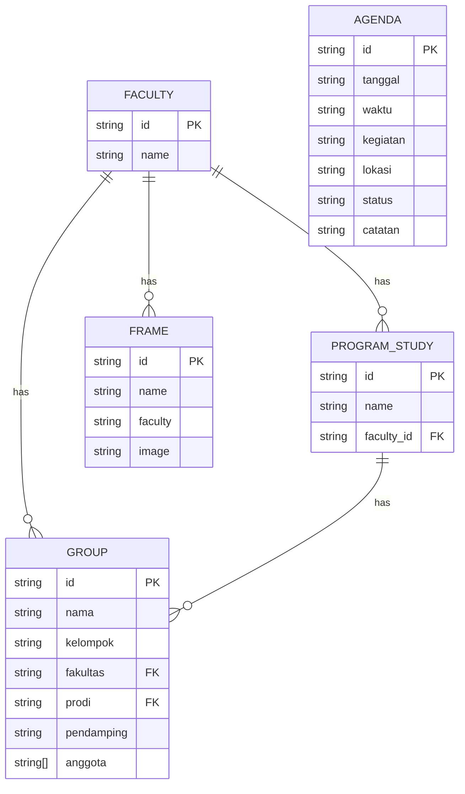
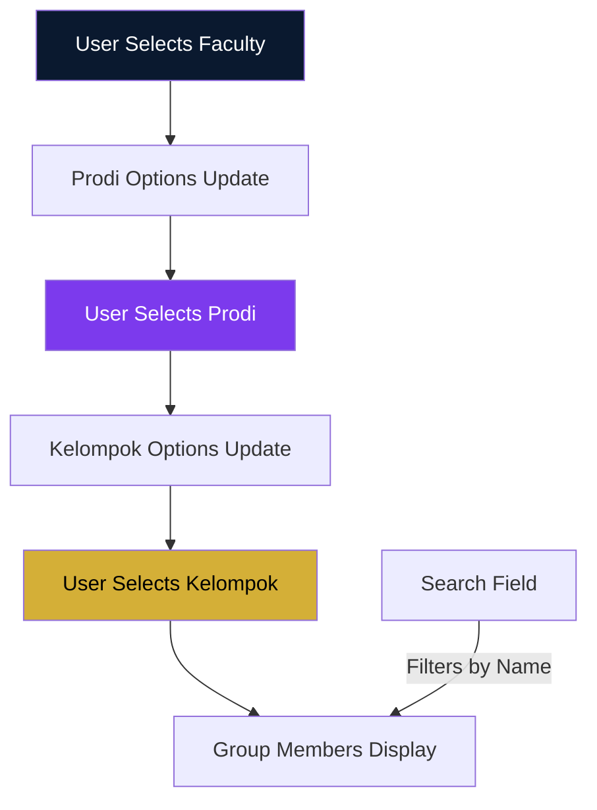

# Data Schema Documentation

## PKKMB IWU — Data Structure Reference

**Version:** 1.0  
**Date:** September 2026

---

## 1. Overview

Semua data dalam aplikasi ini bersifat **static** dan di-hardcode sebagai TypeScript constants. Tidak ada database atau API backend.

---

## 2. Frame Data

**File:** `src/data/frames.ts`

```typescript
export interface Frame {
  id: string;
  name: string;
  faculty: 'all' | 'fst' | 'fisbis' | 'pasca';
  image: string;
}

export const frames: Frame[] = [
  {
    id: 'pkkmb-2026',
    name: 'PKKMB 2026',
    faculty: 'all',
    image: '/frames/pkkmb-2026.png'
  },
  {
    id: 'fst',
    name: 'Sains & Teknologi',
    faculty: 'fst',
    image: '/frames/fst.png'
  },
  {
    id: 'fisbis',
    name: 'Ilmu Sosial & Bisnis',
    faculty: 'fisbis',
    image: '/frames/fisbis.png'
  },
  {
    id: 'pasca',
    name: 'Pascasarjana',
    faculty: 'pasca',
    image: '/frames/pasca.png'
  }
];
```

### Frame Properties

| Property | Type | Description |
|----------|------|-------------|
| id | string | Unique identifier |
| name | string | Display name |
| faculty | enum | Faculty filter ('all' = all faculties) |
| image | string | Path to frame PNG in `/public/frames/` |

### Frame Asset Requirements

- Format: PNG with transparency
- Size: 1080×1080 px (recommended)
- File size: < 500KB each
- Background: Transparent (frame overlay only)

---

## 3. Agenda Data

**File:** `src/data/agenda.ts`

```typescript
export interface AgendaItem {
  id: string;
  tanggal: string;
  waktu: string;
  kegiatan: string;
  lokasi: string;
  status: 'upcoming' | 'today' | 'completed';
  catatan?: string;
}

export const agenda: AgendaItem[] = [
  {
    id: '1',
    tanggal: '08 SEP',
    waktu: '08:00',
    kegiatan: 'Opening PKKMB',
    lokasi: 'Gedung Utama IWU',
    status: 'upcoming',
    catatan: 'Hadir tepat waktu dengan atribut lengkap'
  },
  {
    id: '2',
    tanggal: '08 SEP',
    waktu: '10:00',
    kegiatan: 'Campus Tour',
    lokasi: 'Seluruh Kampus IWU',
    status: 'upcoming',
    catatan: 'Dibagi per kelompok'
  },
  {
    id: '3',
    tanggal: '09 SEP',
    waktu: '08:00',
    kegiatan: 'Workshop Kepemimpinan',
    lokasi: 'Lab Komputer',
    status: 'upcoming',
    catatan: 'Bawa laptop jika memungkinkan'
  },
  {
    id: '4',
    tanggal: '09 SEP',
    waktu: '13:00',
    kegiatan: 'Team Building',
    lokasi: 'Lapangan Utama',
    status: 'upcoming',
    catatan: 'Gunakan sepatu nyaman'
  },
  {
    id: '5',
    tanggal: '10 SEP',
    waktu: '08:00',
    kegiatan: 'Seminar Motivasi',
    lokasi: 'Auditorium',
    status: 'upcoming',
    catatan: ''
  },
  {
    id: '6',
    tanggal: '10 SEP',
    waktu: '15:00',
    kegiatan: 'Closing Ceremony',
    lokasi: 'Auditorium',
    status: 'upcoming',
    catatan: 'Foto bersama'
  }
];
```

### Agenda Properties

| Property | Type | Description |
|----------|------|-------------|
| id | string | Unique identifier |
| tanggal | string | Display date (e.g., '08 SEP') |
| waktu | string | Time (e.g., '08:00') |
| kegiatan | string | Event name |
| lokasi | string | Location |
| status | enum | Event status |
| catatan | string? | Optional notes |

### Status Values

| Value | Display | Color |
|-------|---------|-------|
| upcoming | Upcoming | Gray/Muted |
| today | Today | Primary (Navy) |
| completed | Completed | Success (Green) |

---

## 4. Groups Data

**File:** `src/data/groups.ts`

```typescript
export interface Faculty {
  id: string;
  name: string;
  prodi: ProgramStudy[];
}

export interface ProgramStudy {
  id: string;
  name: string;
}

export interface Group {
  id: string;
  nama: string;
  kelompok: string;
  fakultas: string;
  prodi: string;
  pendamping: string;
  anggota: string[];
}

export const faculties: Faculty[] = [
  {
    id: 'fst',
    name: 'Fakultas Sains & Teknologi',
    prodi: [
      { id: 'informatika', name: 'Informatika' },
      { id: 'sistem-informasi', name: 'Sistem Informasi' },
      { id: 'teknik-informatika', name: 'Teknik Informatika' }
    ]
  },
  {
    id: 'fisbis',
    name: 'Fakultas Ilmu Sosial & Bisnis',
    prodi: [
      { id: 'manajemen', name: 'Manajemen' },
      { id: 'akuntansi', name: 'Akuntansi' },
      { id: 'ekonomi', name: 'Ekonomi' }
    ]
  },
  {
    id: 'pasca',
    name: 'Pascasarjana',
    prodi: [
      { id: 'magister-manajemen', name: 'Magister Manajemen' },
      { id: 'magister-teknik', name: 'Magister Teknik' }
    ]
  }
];

export const groups: Group[] = [
  {
    id: '1',
    nama: 'Kelompok 01',
    kelompok: '01',
    fakultas: 'fst',
    prodi: 'informatika',
    pendamping: 'Rina Wulandari',
    anggota: [
      'Adinda Putri',
      'Bunga Citra',
      'Citra Dewi',
      'Dian Permata',
      'Eka Sari'
    ]
  },
  {
    id: '2',
    nama: 'Kelompok 02',
    kelompok: '02',
    fakultas: 'fst',
    prodi: 'sistem-informasi',
    pendamping: 'Maya Sari',
    anggota: [
      'Fani Amalia',
      'Gita Puspita',
      'Hana Permata',
      'Indah Cahaya',
      'Jesica Tan'
    ]
  },
  {
    id: '3',
    nama: 'Kelompok 03',
    kelompok: '03',
    fakultas: 'fst',
    prodi: 'teknik-informatika',
    pendamping: 'Sari Dewi',
    anggota: [
      'Kartika Sari',
      'Lestari Dewi',
      'Maya Anggraeni',
      'Nina Sartika',
      'Oktavia Rani'
    ]
  },
  {
    id: '4',
    nama: 'Kelompok 04',
    kelompok: '04',
    fakultas: 'fisbis',
    prodi: 'manajemen',
    pendamping: 'Dewi Kusuma',
    anggota: [
      'Putri Ariani',
      'Ratna Sari',
      'Siti Nurhaliza',
      'Tania Puspita',
      'Ulya Maghfiroh'
    ]
  },
  {
    id: '5',
    nama: 'Kelompok 05',
    kelompok: '05',
    fakultas: 'fisbis',
    prodi: 'akuntansi',
    pendamping: 'Ratna Sari',
    anggota: [
      'Vera Maghfiroh',
      'Winda Sari',
      'Xenia Putri',
      'Yulia Cahya',
      'Zahra Amelia'
    ]
  },
  {
    id: '6',
    nama: 'Kelompok 06',
    kelompok: '06',
    fakultas: 'fisbis',
    prodi: 'ekonomi',
    pendamping: 'Lestari Dewi',
    anggota: [
      'Anisa Rahmawati',
      'Bella Salsabila',
      'Citra Anindya',
      'Dinda Puspita',
      'Erlina Sari'
    ]
  },
  {
    id: '7',
    nama: 'Kelompok 07',
    kelompok: '07',
    fakultas: 'pasca',
    prodi: 'magister-manajemen',
    pendamping: 'Hana Permata',
    anggota: [
      'Fauzia Aminah',
      'Ghea Salsabila',
      'Hana Nurul',
      'Ika Puspitasari',
      'Julia Eka'
    ]
  },
  {
    id: '8',
    nama: 'Kelompok 08',
    kelompok: '08',
    fakultas: 'pasca',
    prodi: 'magister-teknik',
    pendamping: 'Indah Cahaya',
    anggota: [
      'Kartini Dewi',
      'Lia Anggraeni',
      'Mega Puspita',
      'Nanda Putri',
      'Oktavia Nur'
    ]
  }
];
```

### Group Properties

| Property | Type | Description |
|----------|------|-------------|
| id | string | Unique identifier |
| nama | string | Display name (e.g., 'Kelompok 01') |
| kelompok | string | Group number |
| fakultas | string | Faculty ID reference |
| prodi | string | Program study ID reference |
| pendamping | string | Mentor name |
| anggota | string[] | List of member names |

### Faculty Properties

| Property | Type | Description |
|----------|------|-------------|
| id | string | Faculty identifier |
| name | string | Faculty display name |
| prodi | ProgramStudy[] | List of program studies |

### Program Study Properties

| Property | Type | Description |
|----------|------|-------------|
| id | string | Program study identifier |
| name | string | Program study display name |

---

## 5. Caption Templates

**File:** `src/lib/caption-generator.ts`

```typescript
export interface CaptionForm {
  nama: string;
  prodi: string;
  kelompok: string;
  motto: string;
}

export const captionTemplate = (data: CaptionForm): string => {
  return `Halo, saya ${data.nama}, mahasiswa baru Program Studi ${data.prodi} International Women University.

Saya siap menjadi bagian dari perjalanan PKKMB IWU 2026 bersama Kelompok ${data.kelompok}.

"${data.motto}"

Let's grow, learn, and lead together.

#PKKMBIWU2026
#InternationalWomenUniversity
#FutureLeadersIWU`;
};

export const alternativeTemplates = [
  // Template 2
  (data: CaptionForm) => `Hi everyone! 👋

Saya ${data.nama}, mahasiswa baru Prodi ${data.prodi} di International Women University.

Senang bisa bergabung di Kelompok ${data.kelompok} PKKMB 2026! ✨

"${data.motto}"

#PKKMBIWU2026 #IWU #FutureLeaders`,

  // Template 3
  (data: CaptionForm) => `Assalamualaikum! 🌸

Perkenalkan, saya ${data.nama} dari Program Studi ${data.prodi}, International Women University.

Bergabung di Kelompok ${data.kelompok} PKKMB 2026!

"${data.motto}"

Let's make this journey memorable! 💫

#PKKMBIWU2026 #InternationalWomenUniversity`
];
```

---

## 6. Data Relationships



### Filtering Logic



---

## 7. Static Data Guidelines

### 7.1 Adding New Data

1. Edit appropriate file in `src/data/`
2. Follow existing interface structure
3. Ensure IDs are unique
4. Use realistic Indonesian names

### 7.2 Updating Data

1. Modify data in source file
2. Rebuild application (`npm run build`)
3. Redeploy to hosting

### 7.3 Data Validation

- All required fields must be present
- IDs must be unique
- Foreign key references must be valid
- Status values must be from enum

---

## 8. Future Data Considerations

### 8.1 API Integration (Future)

If backend is added later:

```typescript
// Example API response
interface ApiResponse<T> {
  success: boolean;
  data: T;
  message?: string;
}

// Example fetch
const fetchGroups = async (): Promise<Group[]> => {
  const response = await fetch('/api/groups');
  const data: ApiResponse<Group[]> = await response.json();
  return data.data;
};
```

### 8.2 Local Storage (Future)

For user preferences:

```typescript
interface UserPreferences {
  lastFrame: string;
  lastZoom: number;
  lastRotation: number;
}
```
