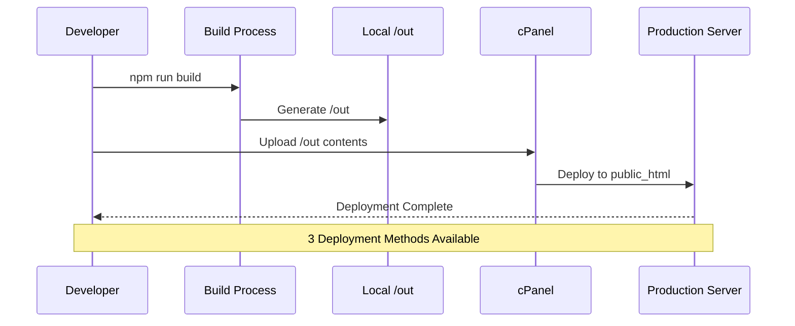
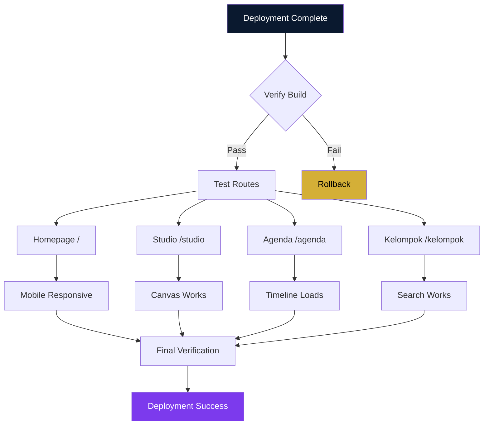
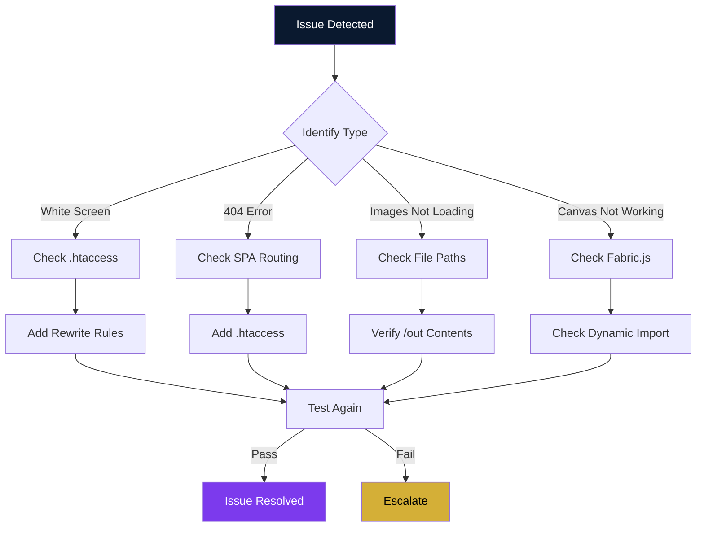
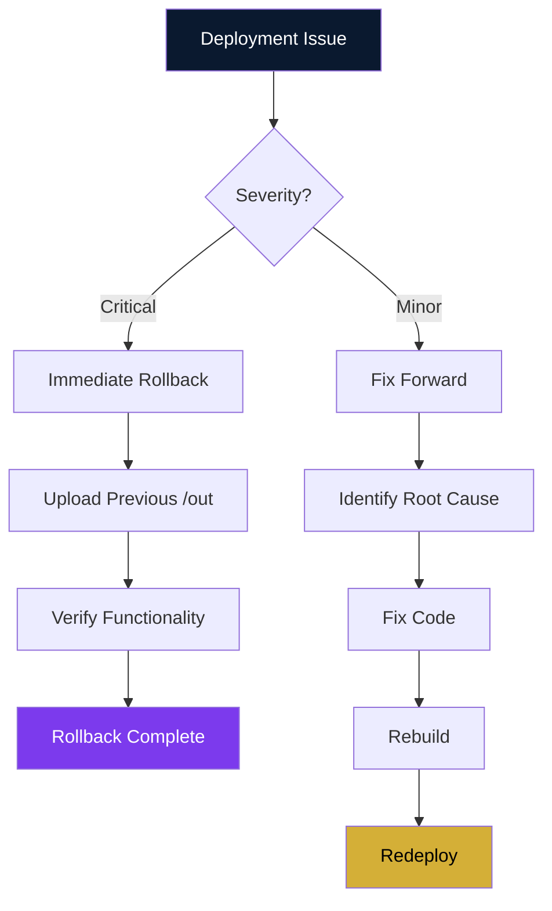

# Deployment Guide

## PKKMB IWU — Deployment Documentation

**Version:** 1.0  
**Date:** September 2026

---

## 1. Prerequisites

### 1.1 Required Software

| Software | Version | Purpose |
|----------|---------|---------|
| Node.js | 18+ | Runtime for build |
| npm | 9+ | Package manager |
| Git | Latest | Version control |

### 1.2 Required Access

- cPanel hosting account
- SSH access (optional)
- File Manager access

---

## 2. Development Setup

### 2.1 Clone Repository

```bash
git clone <repository-url>
cd pkkmb-iwu
```

### 2.2 Install Dependencies

```bash
npm install
```

### 2.3 Start Development Server

```bash
npm run dev
```

Access at: `http://localhost:3000`

### 2.4 Available Scripts

| Script | Command | Description |
|--------|---------|-------------|
| dev | `npm run dev` | Start development server |
| build | `npm run build` | Create production build |
| start | `npm run start` | Start production server |
| lint | `npm run lint` | Run ESLint |

---

## 3. Production Build

### 3.1 Build Process

```mermaid
flowchart LR
    A[npm run build] --> B[Next.js Build]
    B --> C[Static Export]
    C --> D[/out Directory]
    D --> E[HTML Files]
    D --> F[CSS Bundles]
    D --> G[JS Bundles]
    D --> H[Frame Assets]
    
    style A fill:#0A192F,color:#fff
    style D fill:#7C3AED,color:#fff
    style E fill:#D4AF37,color:#000
```

### 3.2 Build Command

```bash
npm run build
```

### 3.2 Build Output

```
/out/
├── index.html
├── studio/
│   └── index.html
├── agenda/
│   └── index.html
├── kelompok/
│   └── index.html
├── _next/
│   ├── static/
│   │   ├── css/
│   │   ├── js/
│   │   └── media/
│   └── ...
├── frames/
│   ├── pkkmb-2026.png
│   ├── fst.png
│   ├── fisbis.png
│   └── pasca.png
└── ...
```

### 3.3 Verify Build

Before deploying, verify:

1. `/out` directory exists
2. HTML files present for all routes
3. `_next/static` contains CSS/JS bundles
4. `frames/` contains all frame assets
5. No build errors in console

---

## 4. cPanel Deployment

### 4.0 Deployment Flow



### 4.1 Method 1: File Manager

1. Login to cPanel
2. Open File Manager
3. Navigate to `public_html`
4. Delete existing files (if any)
5. Upload contents of `/out/` directory
6. Ensure `.htaccess` is uploaded (for SPA routing)

### 4.2 Method 2: FTP Upload

1. Connect via FTP client
2. Navigate to `public_html`
3. Upload all contents from `/out/`
4. Verify file permissions:
   - Directories: 755
   - Files: 644

### 4.3 Method 3: SSH (if available)

```bash
# Connect to server
ssh username@your-domain.com

# Navigate to public_html
cd public_html

# Remove old files
rm -rf *

# Upload build locally, then SCP
scp -r /out/* username@your-domain.com:public_html/

# Or use rsync
rsync -avz /out/ username@your-domain.com:public_html/
```

---

## 5. .htaccess Configuration

### 5.1 Create .htaccess File

Create `.htaccess` in `public_html` root:

```apache
RewriteEngine On
RewriteBase /

# Handle client-side routing (SPA)
RewriteRule ^index\.html$ - [L]
RewriteCond %{REQUEST_FILENAME} !-f
RewriteCond %{REQUEST_FILENAME} !-d
RewriteRule . /index.html [L]

# Enable gzip compression
<IfModule mod_deflate.c>
  AddOutputFilterByType DEFLATE text/html
  AddOutputFilterByType DEFLATE text/css
  AddOutputFilterByType DEFLATE application/javascript
  AddOutputFilterByType DEFLATE application/json
  AddOutputFilterByType DEFLATE image/svg+xml
</IfModule>

# Cache static assets
<IfModule mod_expires.c>
  ExpiresActive On
  ExpiresByType text/css "access plus 1 year"
  ExpiresByType application/javascript "access plus 1 year"
  ExpiresByType image/png "access plus 1 year"
  ExpiresByType image/jpeg "access plus 1 year"
  ExpiresByType image/webp "access plus 1 year"
</IfModule>

# Security headers
<IfModule mod_headers.c>
  Header set X-Content-Type-Options "nosniff"
  Header set X-Frame-Options "SAMEORIGIN"
  Header set X-XSS-Protection "1; mode=block"
</IfModule>
```

---

## 6. Custom Domain Setup

### 6.1 DNS Configuration

If using custom domain:

1. Add A record pointing to cPanel IP
2. Add CNAME record for www subdomain
3. Wait for DNS propagation (24-48 hours)

### 6.2 SSL Certificate

1. Go to cPanel → SSL/TLS
2. Enable Auto SSL or install custom certificate
3. Force HTTPS redirect

### 6.3 Force HTTPS

Add to `.htaccess`:

```apache
RewriteEngine On
RewriteCond %{HTTPS} off
RewriteRule ^(.*)$ https://%{HTTP_HOST}%{REQUEST_URI} [L,R=301]
```

---

## 7. Post-Deployment Verification

### 7.0 Verification Flow



### 7.1 Checklist

- [ ] Homepage loads correctly
- [ ] Navigation works (all routes)
- [ ] Studio page loads
- [ ] Frame selector shows frames
- [ ] Photo upload works
- [ ] Canvas renders correctly
- [ ] Export produces PNG
- [ ] Caption generator works
- [ ] Agenda page loads
- [ ] Kelompok search works
- [ ] Mobile responsive
- [ ] No console errors
- [ ] SSL active (HTTPS)
- [ ] 404 page works (for invalid routes)

### 7.2 Test URLs

| Route | Expected Result |
|-------|-----------------|
| `/` | Homepage loads |
| `/studio` | Studio page loads |
| `/agenda` | Agenda page loads |
| `/kelompok` | Kelompok page loads |
| `/invalid` | 404 page or redirect |

### 7.3 Mobile Testing

Test on:
- Android Chrome (360px-430px)
- iOS Safari
- Samsung Internet

---

## 8. Troubleshooting

### 8.0 Troubleshooting Flow



### 8.1 Common Issues

#### White Screen After Deploy

**Cause:** SPA routing not configured

**Solution:** Ensure `.htaccess` is present with rewrite rules

#### 404 on Page Refresh

**Cause:** Server tries to find physical file for route

**Solution:** Add rewrite rule to serve `index.html` for all routes

#### Images Not Loading

**Cause:** Incorrect file paths or permissions

**Solution:**
1. Check file paths in code
2. Verify files exist in `/out`
3. Check file permissions (644)

#### Fonts Not Loading

**Cause:** CORS or caching issues

**Solution:** Check browser console, clear cache

#### Canvas Not Working

**Cause:** Fabric.js not loading

**Solution:**
1. Check `_next/static/js` bundle
2. Verify dynamic import working
3. Check console for errors

---

## 9. Performance Optimization

### 9.1 Pre-Deployment

- [ ] Compress frame images (WebP/PNG)
- [ ] Minimize unused code
- [ ] Remove console.logs
- [ ] Optimize bundle size

### 9.2 Post-Deployment

- [ ] Enable gzip compression
- [ ] Set cache headers
- [ ] Use CDN (optional)
- [ ] Monitor performance

### 9.3 Monitoring Tools

- Google PageSpeed Insights
- GTmetrix
- WebPageTest
- Chrome DevTools Lighthouse

---

## 10. Rollback Procedure

### 10.0 Rollback Flow



If deployment fails:

### 10.1 Quick Rollback

1. Keep previous `/out` backup locally
2. Upload backup to `public_html`
3. Verify functionality

### 10.2 Git Rollback

```bash
# Revert to previous commit
git revert HEAD

# Rebuild
npm run build

# Redeploy
```

---

## 11. Environment Variables (Future)

If needed in future:

```env
# .env.local
NEXT_PUBLIC_SITE_URL=https://your-domain.com
NEXT_PUBLIC_GA_ID=UA-XXXXXXXXX
```

**Note:** Static export doesn't support server-side env vars.

---

## 12. Backup Strategy

### 12.1 What to Backup

- Source code (Git repository)
- Frame assets (`/public/frames/`)
- Data files (`/src/data/`)
- Documentation (`/docs/`)

### 12.2 Backup Frequency

- Code: Every commit (Git)
- Data: Before any changes
- Full: Weekly

---

## 13. Support

### 13.1 Documentation

- `docs/PRD.md` - Product requirements
- `docs/ARCHITECTURE.md` - Technical architecture
- `docs/COMPONENTS.md` - Component API
- `docs/DATA.md` - Data schema

### 13.2 Issue Reporting

Contact development team for:
- Build errors
- Deployment issues
- Bug reports
- Feature requests
