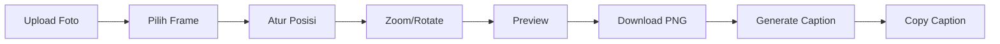
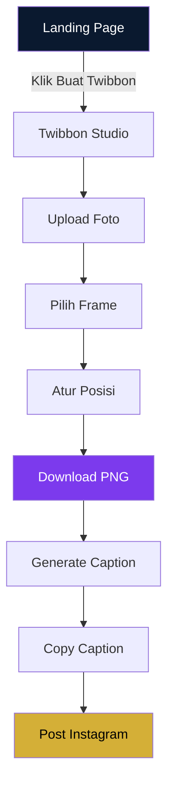
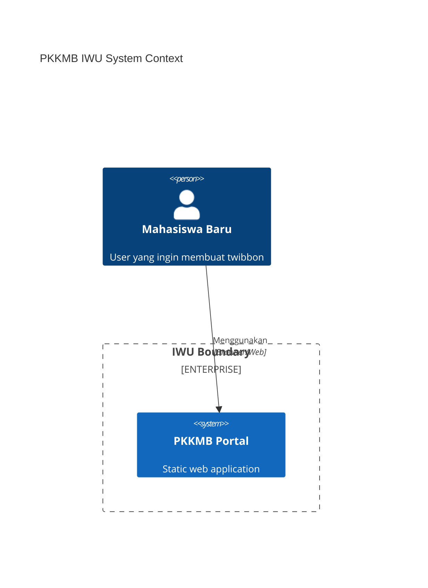
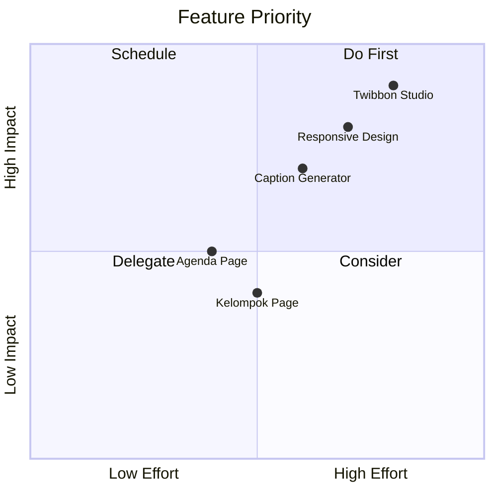

# Product Requirements Document (PRD)

## PKKMB IWU — New Student Experience Portal

**Version:** 1.0  
**Date:** September 2026  
**Status:** Active Development

---

## 1. Executive Summary

PKKMB IWU adalah portal digital untuk mahasiswa baru International Women University yang menyediakan fitur utama **Twibbon Studio** — tool pembuatan foto profil PKKMB langsung di browser tanpa backend. Portal ini juga menyajikan agenda, panduan, dan informasi kelompok peserta PKKMB.

---

## 2. Product Goals

| # | Goal | Success Metric |
|---|------|----------------|
| G1 | Membantu maba membuat Twibbon PKKMB | 80% user berhasil download Twibbon |
| G2 | Memberikan informasi jadwal PKKMB | Semua agenda dapat diakses |
| G3 | Menampilkan informasi kelompok | User dapat mencari kelompoknya |
| G4 | Membantu membuat caption Instagram | Caption generated dan copied |
| G5 | Merepresentasikan IWU sebagai kampus modern | Design memenuhi quality checklist |

---

## 3. Target Users

| User Segment | Description | Primary Feature |
|-------------|-------------|-----------------|
| Mahasiswa Baru | Target utama, user mobile-first | Twibbon Studio, Caption Generator |
| Peserta PKKMB | Membutuhkan jadwal dan info kelompok | Agenda, Kelompok |
| Panitia PKKMB | Membutuhkan tool distribusi info | Semua halaman |
| Civitas Akademika | Monitoring kegiatan | Agenda |

---

## 4. Feature Specifications

### 4.1 Homepage (`/`)

**Purpose:** Portal entry point, navigasi ke fitur utama

**Components:**
- Hero section (editorial layout, bukan SaaS-style)
- Small eyebrow: `PKKMB 2026`
- Headline: `Welcome, Future Leaders.`
- Description: Mulai perjalananmu di IWU...
- CTA utama: `Buat Twibbon` → `/studio`
- CTA sekunder: `Lihat Agenda` → `/agenda`
- Footer info: `International Women University · Bandung`

**Constraints:**
- Tidak ada floating shapes, animated blobs, gradient mesh
- Maksimal 1 visual image
- Flat hierarchy, whitespace cukup

---

### 4.2 Twibbon Studio (`/studio`)

**Purpose:** Fitur utama — membuat foto twibbon PKKMB

**User Flow:**



**Canvas Specifications:**
- Preview size: 350×350 px
- Export size: 1080×1080 px (configurable hingga 2000×2000)
- Layer hierarchy: Photo (bottom) → Frame (top, non-selectable)

**Controls:**
| Control | Type | Description |
|---------|------|-------------|
| Upload Foto | FileInput | JPG, JPEG, PNG, WEBP |
| Pilih Frame | Thumbnail picker | Data-driven frame list |
| Position | Drag on canvas | Touch/mouse drag |
| Zoom | Mantine Slider | Scale photo |
| Rotation | Mantine Slider / Preset | -15°, 0°, 15° |
| Reset | Button | Kembali ke posisi default |
| Download | Button | Export PNG high-res |
| Caption | Section | Generate caption Instagram |

**Frame System:**
```typescript
interface Frame {
  id: string;
  name: string;
  faculty: 'all' | 'fst' | 'fisbis' | 'pasca';
  image: string; // path to PNG frame
}
```

**Canvas Layering Rules:**
- Frame: `selectable = false`, `evented = false`
- Photo: `selectable = true`, `evented = true`
- Frame selalu di depan photo

**Export Rules:**
- Format: PNG
- Filename: `PKKMB-IWU-2026-{nama}.png` atau `PKKMB-IWU-2026-Twibbon.png`
- Hanya artwork, tidak ada UI/controls
- High resolution, tidak blur

**Privacy:**
- Semua proses client-side
- Tidak ada upload ke server
- Microcopy: `Foto kamu diproses langsung di perangkat dan tidak diunggah ke server.`

---

### 4.3 Caption Generator (di `/studio`)

**Purpose:** Membantu maba membuat caption Instagram

**Form Fields:**
| Field | Type | Required |
|-------|------|----------|
| Nama Lengkap | TextInput | Yes |
| Program Studi | Select | Yes |
| Kelompok PKKMB | Select | Yes |
| Motto / Quote | Textarea | No |

**Output Template:**
```
Halo, saya [Nama], mahasiswa baru Program Studi [Prodi] International Women University.

Saya siap menjadi bagian dari perjalanan PKKMB IWU 2026 bersama Kelompok [Kelompok].

"[Motto]"

Let's grow, learn, and lead together.

#PKKMBIWU2026
#InternationalWomenUniversity
#FutureLeadersIWU
```

**Actions:**
- Preview caption
- Copy to clipboard (Clipboard API)
- Regenerate (acak template)
- Success notification: `Caption berhasil disalin.`

---

### 4.4 Agenda Page (`/agenda`)

**Purpose:** Menampilkan jadwal dan panduan PKKMB

**Data Fields:**
| Field | Type |
|-------|------|
| tanggal | Date |
| waktu | Time |
| kegiatan | String |
| lokasi | String |
| status | 'upcoming' \| 'today' \| 'completed' |
| catatan | String (optional) |

**Display:**
- Desktop: Timeline atau compact list
- Mobile: Vertical timeline (bukan tabel besar)
- Status: Mantine Badge (warna berbeda per status)

**Panduan Section:**
- Sebelum PKKMB (Accordion)
- Saat PKKMB (Accordion)
- Gunakan Mantine Accordion

---

### 4.5 Kelompok Page (`/kelompok`)

**Purpose:** Pencarian informasi kelompok peserta

**Filters:**
1. Fakultas (Select)
2. Program Studi (Select, dependent on Fakultas)
3. Kelompok (Select, dependent on Prodi)
4. Search field (free text)

**Display:**
```
Kelompok 07

Pendamping:
Nama Pendamping

Anggota:
- Nama 1
- Nama 2
- Nama 3
```

**Constraints:**
- Jangan tampilkan semua peserta sekaligus jika jumlah besar
- Gunakan search untuk filtering

---

## 5. Non-Functional Requirements

### 5.1 Performance

| Metric | Target |
|--------|--------|
| First Contentful Paint | < 1.5s |
| Largest Contentful Paint | < 2.5s |
| Time to Interactive | < 3s |
| Bundle Size (initial) | < 200KB gzipped |
| Image Processing | Client-side only |

**Optimizations:**
- Static rendering
- Lazy loading images
- Dynamic import Fabric.js
- Compressed frame assets (WebP/PNG)
- Minimal unused JS

### 5.2 Responsive Design

| Breakpoint | Width | Priority |
|-----------|-------|----------|
| Mobile | 360px - 430px | Primary |
| Tablet | 768px | Secondary |
| Desktop | 1024px+ | Tertiary |

**Mobile Requirements:**
- Canvas fit viewport
- Controls vertical layout
- Touch target minimum: 44×44px
- No horizontal overflow
- Typography nyaman di mobile

### 5.3 Accessibility

- Semantic HTML
- ARIA labels untuk icon-only buttons
- Keyboard navigation
- Sufficient color contrast (WCAG AA)
- Focus states visible
- Alt text untuk images

### 5.4 Browser Support

- Chrome 90+
- Firefox 88+
- Safari 14+
- Edge 90+
- Samsung Internet 15+

---

## 6. Design Constraints

### 6.1 Visual Identity

**Colors:**
| Role | Hex |
|------|-----|
| Primary | #0A192F |
| Secondary | #0F2042 |
| Accent Purple | #7C3AED |
| Warm Gold | #D4AF37 |
| Background | #F8FAFC |
| Surface | #FFFFFF |
| Text | #0F172A |
| Muted | #64748B |

**Typography:**
- Font: Plus Jakarta Sans
- Display: bold/semibold
- Heading: semibold
- Body: regular
- Caption: medium
- Max headline: `clamp(2.5rem, 8vw, 5.5rem)`

### 6.2 Anti-Patterns (Hindari)

- SaaS template generik
- Dashboard dengan banyak card
- Gradient ungu-biru berlebihan
- Glassmorphism di setiap komponen
- Rounded-3xl pada semua elemen
- Shadow besar pada setiap card
- Floating blobs
- Hero section terlalu tinggi
- Icon dalam lingkaran di setiap section
- Teks marketing generik

### 6.3 Approved Components (Mantine)

Button, Tabs, Modal, Drawer, TextInput, Select, FileInput, Badge, Paper, Card, Tooltip, Notification, SegmentedControl, Accordion, Progress, Loading states

---

## 7. Technical Constraints

| Constraint | Requirement |
|-----------|-------------|
| Backend | Tidak ada (static export) |
| Database | Tidak ada |
| Server Upload | Tidak ada untuk foto |
| Runtime | Client-side only |
| Deployment | cPanel static hosting |
| Framework | Next.js App Router |
| Output | `/out` directory |

---

## 8. Data Requirements

### 8.1 Static Data

Semua data di-hardcode sebagai TypeScript constants:

- `frames.ts` — Daftar frame twibbon
- `agenda.ts` — Jadwal PKKMB
- `groups.ts` — Data kelompok dan anggota

### 8.2 Sample Data Requirements

- Nama program studi realistis
- Nama mahasiswa Indonesia
- Lokasi di Bandung
- Jadwal PKKMB September 2026

---

## 9. Success Criteria

### 9.1 Definition of Done

- [ ] Semua fitur berjalan tanpa backend
- [ ] `npm run build` berhasil
- [ ] Static export ke `/out` berhasil
- [ ] Fabric.js hanya berjalan client-side
- [ ] Tidak ada foto yang dikirim ke server
- [ ] Mobile responsive di 360px-430px
- [ ] Touch target ≥ 44px
- [ ] Tidak ada horizontal overflow
- [ ] Loading state untuk semua async operation
- [ ] Error state untuk semua edge cases
- [ ] Empty state untuk data kosong
- [ ] SEO metadata lengkap
- [ ] Accessibility checklist passed

### 9.2 User Journey Success



---

## 10. Out of Scope (MVP)

- User authentication
- Backend API
- Database
- Real-time data
- Social login
- Analytics dashboard
- Admin panel
- Multi-language
- PWA features

---

## Appendix

### A. System Context Diagram



### B. Feature Priority Matrix



### C. Frame Assets Required

| ID | Name | Faculty |
|----|------|---------|
| pkkmb-2026 | PKKMB 2026 | all |
| fst | Sains & Teknologi | fst |
| fisbis | Ilmu Sosial & Bisnis | fisbis |
| pasca | Pascasarjana | pasca |

### B. Agenda Sample Data

| Date | Time | Event | Location |
|------|------|-------|----------|
| 08 SEP | 08:00 | Opening PKKMB | Gedung Utama IWU |
| 08 SEP | 10:00 | Campus Tour | Seluruh Kampus |
| 09 SEP | 08:00 | Workshop | Lab Komputer |
| 10 SEP | 08:00 | Closing Ceremony | Auditorium |

### C. Kelompok Sample Structure

| Kelompok | Fakultas | Prodi | Pendamping |
|----------|----------|-------|------------|
| 01 | FST | Informatika | Kakak 1 |
| 02 | FST | Sistem Informasi | Kakak 2 |
| 03 | FISBIS | Manajemen | Kakak 3 |
| 04 | FISBIS | Akuntansi | Kakak 4 |
| 05 | PASCA | Magister Manajemen | Kakak 5 |
